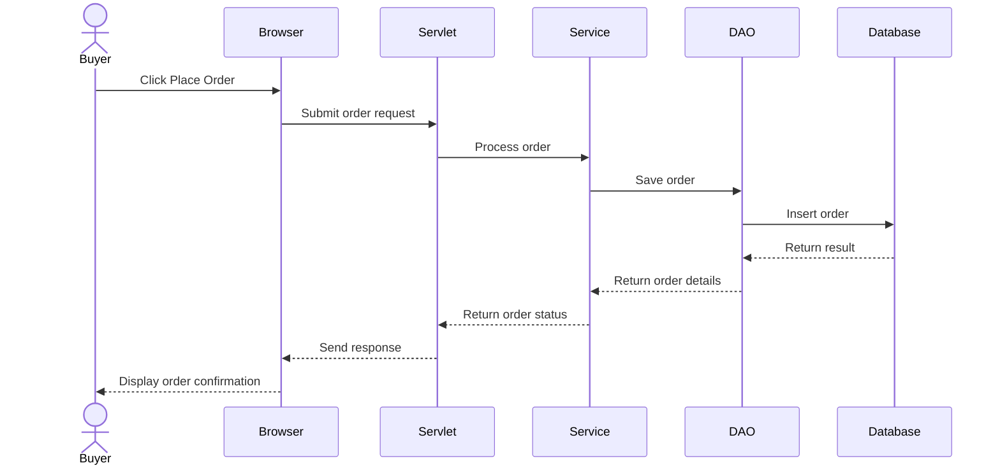

# NexoMart: Design Diagrams

Diagrams D1 to D5 for the NexoMart project.

## D1. ER Diagram

```mermaid
erDiagram
    USERS ||--o{ PRODUCTS : "sells"
    USERS ||--o{ ORDERS : "places"
    USERS ||--o{ CART_ITEMS : "has"
    USERS ||--o{ REVIEWS : "writes"
    ORDERS ||--|{ ORDER_ITEMS : "contains"
    PRODUCTS ||--o{ ORDER_ITEMS : "included in"
    PRODUCTS ||--o{ CART_ITEMS : "added to"
    PRODUCTS ||--o{ REVIEWS : "receives"

    USERS {
        BIGINT id PK
        VARCHAR name
        VARCHAR email UK
        VARCHAR password_hash
        VARCHAR role
        TIMESTAMP created_at
    }

    PRODUCTS {
        BIGINT id PK
        BIGINT seller_id FK
        VARCHAR name
        CLOB description
        DECIMAL price
        INT stock_qty
        VARCHAR category
        VARCHAR image_url
        TIMESTAMP created_at
    }

    ORDERS {
        BIGINT id PK
        BIGINT buyer_id FK
        VARCHAR status
        DECIMAL total_amount
        TIMESTAMP created_at
    }

    ORDER_ITEMS {
        BIGINT id PK
        BIGINT order_id FK
        BIGINT product_id FK
        INT quantity
        DECIMAL unit_price
    }

    CART_ITEMS {
        BIGINT id PK
        BIGINT user_id FK
        BIGINT product_id FK
        INT quantity
        TIMESTAMP created_at
    }

    REVIEWS {
        BIGINT id PK
        BIGINT product_id FK
        BIGINT user_id FK
        INT rating
        VARCHAR comment
        TIMESTAMP created_at
    }
## D2 — Use Case Diagram

```mermaid
flowchart TB
    Buyer([Buyer])
    Seller([Seller])
    Admin([Admin])

    subgraph System["E-Commerce System"]
        F1["F1: Register / Login"]
        F2["F2: Browse Products"]
        F3["F3: Search Products"]
        F4["F4: Place Order"]
        F5["F5: Manage Products"]
        F6["F6: Manage Orders"]
        F7["F7: Manage Users"]
        F8["F8: View Reports"]
    end

    Buyer --> F1
    Buyer --> F2
    Buyer --> F3
    Buyer --> F4

    Seller --> F1
    Seller --> F5
    Seller --> F6

    Admin --> F1
    Admin --> F7
    Admin --> F8
```
## D3 — Sequence Diagram (Place Order Flow)

